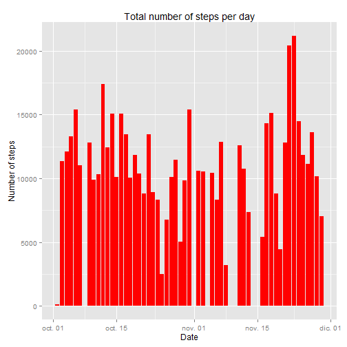
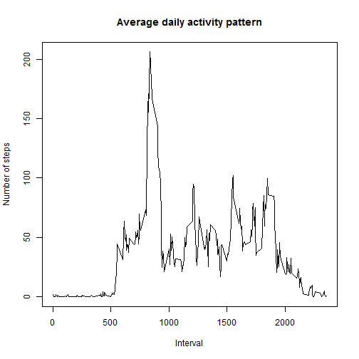
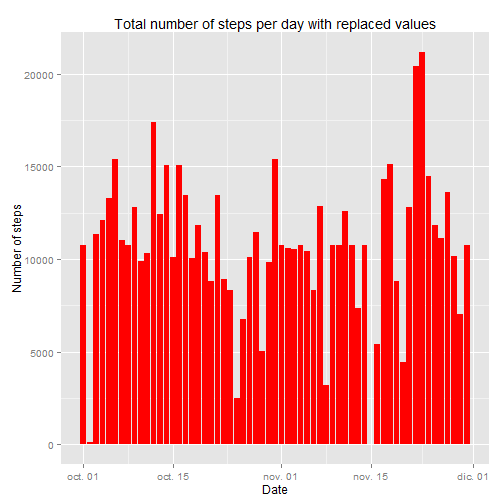
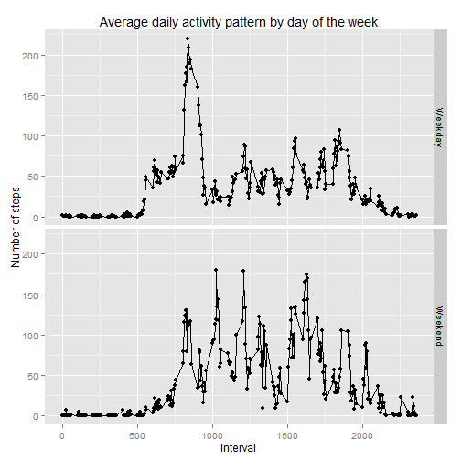

===========================================================  
This document contains the results of the first Assignment of the Reproducible research course.
For information about the assignment please go to the [Readme.md](https://github.com/Paulamg/RepData_PeerAssessment1/blob/master/README.md) file.


First, we will read the data

```r
setwd("F:/Coursera/Reproducible research/Assingment 1")
activity <- read.csv("activity.csv", header=TRUE)
activity$date <- as.Date.factor(activity$date, "%Y-%m-%d")
```

#What is mean total number of steps taken per day?

To answer this question, we will create a table with the sum of steps per day and then plot this using ggplot

```r
bydate <- group_by(activity, date)
steps <- summarize(bydate, sumsteps=sum(steps))
p <- ggplot(steps, aes(x=date, y=sumsteps)) + geom_bar(stat="identity", fill="red")
q <- p  + ggtitle("Total number of steps per day" )+ xlab("Date") + ylab("Number of steps")
print(q)
```

```
## Warning: Removed 8 rows containing missing values (position_stack).
```

 

###Calculate  the median and mean

```r
meansteps=mean(steps$sumsteps, na.rm = T)
mediansteps=median(steps$sumsteps, na.rm = T)
```

The mean of the total steps per day was 1.0766189 &times; 10<sup>4</sup>, while the median was 10765.

#What is the average daily activity pattern?

For this question, we must group the data by interval and calculate the mean for each, then plot the data and calculate the total mean and median

```r
byinterval <- group_by(activity, interval)
stepsint <- summarize(byinterval, medsteps=mean(steps, na.rm=T))
with(stepsint, plot(interval, medsteps, xlab="Interval", ylab="Number of steps", type="l", 
           main="Average daily activity pattern"))
```

 

```r
maxstep <- max(stepsint$medsteps)
maxint <- as.numeric(stepsint[which(stepsint$medsteps==maxstep), 1])
```

The 5-minute interval with the highest average number of steps was 835 with 206.1698113

##Imputing missing values


```r
miss <- length(which(is.na(activity$steps)))
```

There are 2304 rows with missing values. Let's fill them with the mean for that interval:


```r
activity.na <- activity[is.na(activity$steps), ]
nafill <- merge(stepsint, activity.na, by = "interval")
nafill <- nafill[ , c(2,4,1)]
names(nafill)[names(nafill) == "medsteps"] <- "steps"
filled <- rbind(na.omit(activity), nafill)
```

Now that we have the new data base, let's plot again the steps per day and calcule the mean and median

```r
bydate2 <- group_by(filled, date)
steps2 <- summarize(bydate2, sumsteps=sum(steps))
e <- ggplot(steps2, aes(x=date, y=sumsteps)) + geom_bar(stat="identity", fill="red") + ggtitle("Total number of steps per day with replaced values")+ xlab("Date") + ylab("Number of steps")
print(e)
```

 

###Calculate the median and mean

```r
meansteps2=mean(steps2$sumsteps, na.rm = T)
mediansteps2=median(steps2$sumsteps, na.rm = T)
```
The mean in the new data base is 1.0766189 &times; 10<sup>4</sup>, while the median was 1.0766189 &times; 10<sup>4</sup>.

#Are there differences in activity patterns between weekdays and weekends?

For this question, first i created a vector containing the weekday as indicated, and then grouped the resulting data by Day and then by interval to finally plot it:

```r
filled$weekday <- weekdays(filled$date)
filled$Day <- ifelse(filled$weekday == "sabado" | filled$weekday == "domingo", "Weekend", "Weekday")
byday <- group_by(filled, Day, interval)
dayd <- summarize(byday, meansteps=mean(steps))
```

#Create the plot

```r
week <- qplot(data=dayd, x=interval, y=meansteps, facets=Day~.) + geom_line() + xlab("Interval") + ylab("Number of steps") + ggtitle("Average daily activity pattern by day of the week")
print(week)
```

 

That's all!

